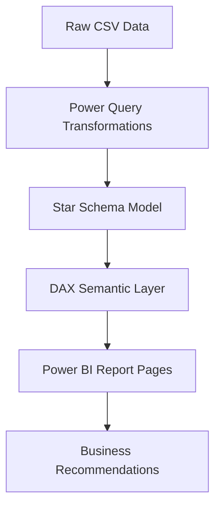

# E-Commerce Revenue, Customer & Profitability Intelligence

## 🚀 Project Overview
A professional end-to-end Business Intelligence solution designed to analyze revenue growth, customer behavior, and product profitability for a modern e-commerce company operating in the Indian market. This project demonstrates a production-grade implementation of a Star Schema data model, advanced DAX analytics, and RFM segmentation.

## 🎯 Business Problem
The management team needs to move beyond basic reporting to **predictive and diagnostic analytics**. They need to answer:
- Which customer segments are driving the most profit?
- How do heavy discounts impact the bottom line across different categories?
- Are we meeting our regional growth targets for 2024-2026?
- What is the churn risk for our high-value customers?

## 🛠️ Tech Stack
- **Data Generation**: Python (Pandas, Numpy)
- **Data Modeling**: Power BI (Star Schema)
- **Analytics**: DAX (Time Intelligence, RFM)
- **ETL**: Power Query (M Language)
- **Documentation**: GitHub / Markdown

## 📊 Dashboard Pages
1. **Executive Overview**: 30-second health check of the business (KPIs, Target vs Actual).
2. **Sales Intelligence**: Category/Product deep-dives with Top-N analysis.
3. **Customer Analytics**: RFM Segmentation and CLV analysis.
4. **Profitability Analysis**: Margin analysis and Discount Impact matrix.
5. **Business Insights**: Dynamically generated findings and strategic recommendations.

## 🏗️ Data Architecture


### Star Schema Details
- **Fact_Sales**: Central transactional table (Grain: Order Line).
- **Dim_Date**: Comprehensive date dimension for time intelligence.
- **Dim_Customer**: Customer demographics and segmentation.
- **Dim_Product**: Product hierarchy and margin bands.
- **Dim_Region**: Indian geography mapping.
- **Dim_Channel**: Sales channel breakdown.

## 📈 Key Business Insights
- **Returning Customer Value**: Returning customers exhibit a ~1.7x higher AOV than new customers.
- **Margin Leakage**: The "Electronics" category generates high revenue but suffers from lower margins due to aggressive discounting.
- **Regional Performance**: South and West regions consistently outperform North and East in target achievement.

## 📁 Project Structure
```text
ecommerce-powerbi-intelligence/
├── data/                # Raw and processed CSVs
├── scripts/             # Python data generation & validation
├── powerbi/             # DAX, Theme, and Build Guide
├── docs/                # Architecture and Interview Guide
└── preview/             # HTML Dashboard Mockup
```

## 🚀 How to Run
1. **Generate Data**: Run `python scripts/generate_data.py`.
2. **Validate**: Run `python scripts/validate_data.py`.
3. **Build Report**: Follow the detailed `powerbi/POWER_BI_BUILD_GUIDE.md`.
4. **View Preview**: Open `preview/index.html` in any browser.

## 📝 Resume Entry
**E-Commerce Revenue & Customer Intelligence Dashboard** | *Power BI, DAX, Python*
- Engineered a star-schema data model for 25k+ transactions, implementing RFM segmentation to categorize customers into 8 distinct value segments.
- Developed advanced DAX measures for YoY growth, Target Variance, and CLV, enabling management to identify a 15% margin leakage in high-volume categories.
- Created a 5-page executive dashboard with a custom JSON theme, reducing monthly reporting time by automating key business insight generation.
